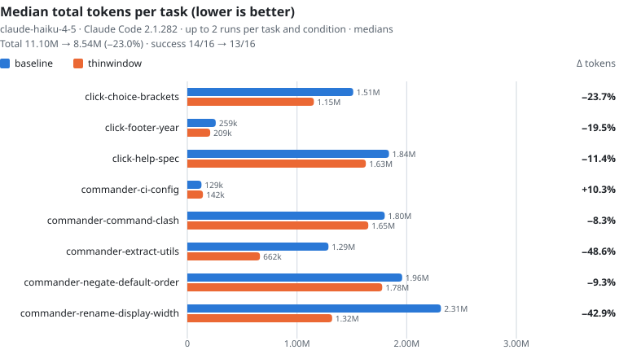

<p align="center">
  
</p>

<h1 align="center">ThinWindow</h1>

<p align="center">
  <strong>Menos na janela. Menos na conta.</strong><br>
  A maior parte dos tokens do seu agente é releitura: de 87% a 96% são contexto reenviado a cada turno. O ThinWindow é ao mesmo tempo um plugin do Claude Code e um Agent Skill, e reduz esse contexto: de 13% a 23% menos tokens, medidos no Claude Code com três modelos.
</p>

<p align="center">
  <a href="README.md">English</a> · <a href="README.es.md">Español</a> · <b>Português</b>
</p>

<!-- RESULTS:START -->
| Modelo | Tokens | Custo | Sucesso base → ThinWindow | Execuções |
| --- | ---: | ---: | :---: | ---: |
| Opus 5.5 | **−15,8%** | **−19,4%** | **16/16** → **16/16** | 32 |
| Sonnet 5 | **−13,2%** | **−7,9%** | **24/24** → **24/24** | 48 |
| Haiku 4.5 | **−23,0%** | **−20,2%** | **14/16** → **13/16** | 32 |

As mesmas 8 tarefas, 112 execuções, um agente por execução, sem descartar
nenhuma: tudo o que foi registrado está na tabela, exceto as execuções que uma
versão posterior do código substituiu na mesma tarefa, guardadas em
[`bench/results/archive/`](bench/results/archive). O detalhe por tarefa e os
dados brutos estão em [Benchmark](#benchmark).
<!-- RESULTS:END -->

## Por que o contexto pesa na conta

Um agente de código não paga principalmente pelo que escreve. Paga pelo que
carrega. Cada arquivo que abre, cada log de instalação que imprime e cada grep
amplo que roda é anexado à conversa, e a conversa inteira é reenviada a cada
turno seguinte. O custo de uma sessão se parece mais com

```
tokens ≈ tamanho do contexto × turnos
```

do que com o tamanho da resposta. Nas execuções base medidas aqui, **de 87% a 96%
de todos os tokens cobrados foram leituras de cache** — contexto reenviado, turno
após turno — contra 0,6% a 1,9% da saída do próprio agente:

<!-- CACHE:START -->
| Modelo | Leituras de cache | Escritas de cache | Saída |
| --- | ---: | ---: | ---: |
| Opus 5.5 | 92,0% | 6,6% | 1,3% |
| Sonnet 5 | 87,1% | 11,0% | 1,9% |
| Haiku 4.5 | 96,4% | 2,9% | 0,6% |
<!-- CACHE:END -->

Essa é toda a tese. Pedir brevidade ao agente mexe na coluna de ~1%. Impedir
que ele puxe um arquivo de 2.000 linhas para o contexto no turno 3 mexe na de
~90%, em todos os turnos seguintes.

O ThinWindow ataca os dois fatores: encolhe o que entra no contexto e evita os
turnos extras gastos lidando com uma saída de que o agente nunca precisou.

## Instalação

**Claude Code** (regras + hooks, a versão completa):

```
/plugin marketplace add thinwindow/thinwindow
/plugin install thinwindow@thinwindow
```

**Qualquer agente com Agent Skills** (Codex, Cursor, Copilot, Gemini CLI,
OpenCode...), somente as regras:

```
npx skills add thinwindow/thinwindow
```

**Agentes que leem `AGENTS.md`**: cole [`adapters/AGENTS.md`](adapters/AGENTS.md)
no `AGENTS.md` do seu projeto.

Desligue quando quiser com `THINWINDOW=off`, ou com `"enabled": false` no
`.thinwindow.json`.

## Como funciona

1. **Regras** ([`rules/thinwindow.md`](rules/thinwindow.md), menos de 500 tokens)
   carregadas no início da sessão: localizar antes de ler, ler por intervalos,
   limitar a saída dos comandos, escrever a menor mudança possível, encerrar com
   no máximo três linhas.
2. **Hooks** (só no Claude Code) que garantem a parte cara sem custar um turno
   ao agente:
   - Um `Read` completo de um arquivo com mais de 400 linhas devolve as primeiras
     120 linhas mais um índice numerado, para que a próxima leitura mire um
     intervalo.
   - A releitura de um arquivo sem alterações que já está no contexto é recusada.
   - Instalações, builds, testes e linters passam pelo `thinwindow-run`: o log
     completo vai para um arquivo temporário e o agente vê o código de saída, o
     final do log e as linhas de erro.
   - `cat` de arquivos enormes, lockfiles ou arquivos minificados, `git log` sem
     `-n`, `ls -R`, `tree` sem `-L` e `find` sem limite recebem uma alternativa
     mais barata. O `Grep` por conteúdo recebe `head_limit: 100`.
3. **Falha em modo aberto.** Qualquer erro de hook deixa a chamada passar.
   Repetir uma chamada recusada também a deixa passar, então o agente nunca fica
   travado.

As regras são garantidas pelos hooks em vez de ficarem a cargo do modelo, porque uma
regra que o agente pode esquecer sob pressão não é uma regra. Os hooks rodam na
chamada da ferramenta, antes de o resultado chegar ao contexto, então aplicá-las
não custa um turno.

Sem dependências, sem telemetria, Node 18+. Detalhes e todas as opções:
[docs/configuration.md](docs/configuration.md).

## Benchmark

<!-- BENCH:START -->
Três modelos, 8 tarefas, 112 execuções. Os gráficos e as tabelas são gerados por
[`bench/report.mjs`](bench/report.mjs) a partir dos arquivos brutos.

### Opus 5.5


### Sonnet 5


### Haiku 4.5


<!-- BENCH:END -->

As tabelas por tarefa, com a dispersão e a taxa de sucesso, estão em
[`bench/results/report.md`](bench/results/report.md) e na
[seção Benchmark do README em inglês](README.md#benchmark) (são geradas em
inglês, por isso não as duplico aqui e assim ficam sempre atualizadas). As
execuções brutas, uma linha por execução, estão em
[`bench/results/`](bench/results).

### Como é medido

Cada **execução** é um agente resolvendo uma tarefa do zero:

1. Clonar um repositório real de código aberto
   ([click](https://github.com/pallets/click) ou
   [commander.js](https://github.com/tj/commander.js)) num commit fixo, dentro de
   um diretório temporário novo.
2. Instalar as dependências antes de o agente começar, para que os logs de
   instalação não sejam cobrados de nenhum dos lados.
3. Rodar `claude -p "<tarefa>"` com o modelo escolhido, com teto de 40 turnos. A
   *baseline* usa o Claude Code puro; o *ThinWindow* usa o mesmo mais este
   plugin. Nada mais muda: sem servidores MCP, sem configurações de usuário, sem
   memória entre execuções.
4. Rodar a verificação oculta da tarefa: um teste ou script que o agente nunca
   vê. Código de saída 0 é sucesso.
5. Registrar tokens (entrada, escritas e leituras de cache, saída, subagentes
   incluídos), custo, turnos e tempo a partir do JSON do próprio Claude Code,
   mais o rastro completo de chamadas de ferramentas.

As 8 tarefas são uma mistura de trabalho do dia a dia: correções de bugs com um teste que
falha, uma funcionalidade pequena, uma renomeação entre arquivos, uma
refatoração, uma consulta de configuração e "fazer o ano do copyright do rodapé se
atualizar sozinho". As definições estão em [`bench/tasks/`](bench/tasks).

As execuções são sequenciais, uma de cada vez, então nunca disputam os limites
de uso. O custo é o preço equivalente de API que o Claude Code informa; numa
assinatura você paga em limites de uso, mas a proporção é a mesma.

### Verifique em vez de acreditar

- Cada execução é uma linha de JSONL em [`bench/results/`](bench/results), com o
  modelo, a versão do Claude Code, o commit do ThinWindow, as contagens brutas
  de tokens e o rastro de ferramentas. Nenhum número deste README é escrito à
  mão.
- Uma tarefa foi medida de novo depois de uma correção. No Sonnet 5, todas as
  execuções com o ThinWindow de commander-ci-config cortaram
  `cat .github/workflows/*.yml` em 60 linhas e perderam o arquivo que a tarefa
  pede; agora o hook mantém inteiras as concatenações curtas
  ([#7](https://github.com/thinwindow/thinwindow/issues/7)). As três execuções
  com o ThinWindow dessa tarefa foram refeitas em 30e9c6b (+29,3% → +3,9%), e as
  três que elas substituem estão em [`bench/results/archive/`](bench/results/archive).
  Nenhuma outra execução registrada faz essa chamada, então nenhuma outra tarefa
  foi refeita.
- As regras foram ajustadas nessas mesmas 8 tarefas, em duas bibliotecas de
  parsing de argumentos de linha de comando, em JavaScript e Python. É uma fatia
  estreita do software que existe. Sua economia em outros trabalhos será
  diferente.
- As amostras são pequenas. Agentes variam muito: a mesma tarefa levou 4 turnos
  em uma execução e 9 na seguinte (commander-extract-utils no Sonnet 5, sem o
  ThinWindow), por isso as tabelas mostram medianas e a faixa por tarefa, e não
  uma única média de manchete.
- Rode contra a sua própria conta e os seus próprios limites:

  ```
  node bench/run.mjs --condition baseline,thinwindow --reps 3 --model sonnet --dry-run
  node bench/run.mjs --condition baseline,thinwindow --reps 3 --model sonnet --max-cost 10
  node bench/report.mjs
  ```

  Todas as opções estão em [bench/README.md](bench/README.md).

### Onde ainda há margem

Estes números são uma medição atual, não um teto. Eles vão se mover conforme
mudarem as regras, os modelos e o próprio Claude Code, e a intenção é continuar
melhorando e republicar os arquivos brutos a cada vez.

Duas coisas aparecem nos dados:

- **Nem toda tarefa melhora.** No Sonnet 5, três das oito tarefas ainda custam
  mais com o ThinWindow do que sem ele. Só neutralizar essas regressões — sem
  economizar um token a mais em nenhum outro lugar — levaria o Sonnet de −13,2%
  para cerca de −17,5%, e o Opus de −15,8% para cerca de −17,7%. A margem de
  curto prazo está mais em não piorar as tarefas curtas do que em espremer as
  longas. O que os rastros mostram de cada uma está na
  [#7](https://github.com/thinwindow/thinwindow/issues/7).
- **Os turnos são o fator inexplorado.** Como o custo é aproximadamente contexto
  × turnos, um turno economizado vale tanto quanto uma leitura grande evitada. O
  Opus usou 12,9% menos turnos aqui e cortou o custo em 19,4%; o Sonnet usou os
  mesmos turnos que sem o ThinWindow e cortou o custo em 7,9%. Uma tentativa
  anterior de regras explícitas de "use menos turnos" piorou o Sonnet de forma
  mensurável e foi revertida, em vez de mantida e silenciosamente excluída: esse
  experimento revertido continua no histórico.

## Contribuindo

Este é exatamente o tipo de projeto que melhora com a carga de trabalho de
outras pessoas, porque os limites acima são os limites da amostra de *uma
pessoa só*.

O mais útil, mais ou menos em ordem:

1. **Resultados de benchmark com a sua stack.** Uma tarefa nova em
   [`bench/tasks/`](bench/tasks) — outra linguagem, um monorepo, um framework
   com muito código gerado — vale mais que uma opinião sobre as regras.
2. **Uma regressão reproduzível.** Um caso em que o ThinWindow custe mais que a
   baseline, com o JSONL que comprove, é um presente: as regressões acima são o
   caminho mais claro para números melhores.
3. **Propostas de regras e hooks**, com a medição que as justifique. As regras
   são testadas contra o benchmark, não aceitas por soarem plausíveis; além disso,
   o arquivo de regras tem um orçamento de tokens que a CI faz cumprir.

O fluxo está em [CONTRIBUTING.md](CONTRIBUTING.md).

## Escopo, limitações e isenção de responsabilidade

Isto começou como uma ferramenta pessoal. Eu a criei para reduzir o custo do meu
próprio fluxo de trabalho, e publiquei porque as medições podem ser úteis para
outra pessoa — não porque seja um produto acabado com um contrato de suporte por
trás.

Leia os números com isso em mente:

- **O benchmark é estreito e escolhido por mim.** Oito tarefas, dois
  repositórios, três modelos, algumas repetições cada, tudo escolhido por mim,
  com regras ajustadas contra essas mesmas tarefas. Dá para mostrar uma direção;
  não dá para prometer uma porcentagem a você. Está publicado por inteiro, com
  os arquivos brutos, justamente para que você julgue o quanto generaliza em vez
  de acreditar num número de manchete.
- **A contabilidade de tokens é volátil por natureza.** O que entra numa janela
  de contexto depende da versão do modelo, do ambiente de execução do agente e do
  seu prompt de sistema, da taxa de acerto de cache, de quais ferramentas estão
  habilitadas, dos servidores MCP, do tamanho do repositório e de como a tarefa
  se desenrola naquele dia. Qualquer um desses fatores pode mover o resultado
  mais que o efeito medido aqui. Duas execuções idênticas da mesma tarefa podem
  divergir bastante; as medianas e faixas das tabelas existem para tornar isso
  visível, não para escondê-lo.
- **Os resultados envelhecem.** Foram medidos com uma versão específica do
  Claude Code e snapshots específicos dos modelos, e ambos mudam com frequência.
  Serão medidos de novo, em vez de continuarem publicados sem revisão.
- **Sem garantia.** Este software é fornecido "como está" sob a
  [licença MIT](LICENSE), sem garantia de nenhum tipo. Você é responsável pelo
  que roda no seu ambiente e pelo que gasta. Os hooks são projetados para falhar
  em modo aberto e nunca bloquear uma chamada, e os testes cobrem esse comportamento,
  mas nenhuma quantidade de testes é uma garantia: revise o código, rode os
  testes e experimente num branch antes de confiar trabalho real a ele.
- **Não substitui um bom prompt.** Ele remove desperdício; não deixa o agente
  mais inteligente.

## Perguntas frequentes

**Isso deixa meu agente pior na tarefa?** É o que a coluna de sucesso em cada
tabela mede. Uma economia que faz a tarefa falhar não é economia. Nos três
modelos o sucesso foi idêntico ao da baseline, exceto em uma tarefa do Haiku,
commander-rename-display-width: 1/2 sem o ThinWindow, 0/2 com ele. O Haiku tem
dificuldade nessa tarefa de qualquer jeito: três das quatro execuções falharam,
e todas levaram 35 turnos ou mais.

**Por que não simplesmente pedir ao agente para ser breve?** Porque a saída é
cerca de 1% da conta, como mostra a tabela do começo. Uma resposta longa é paga
uma vez; uma leitura longa é paga de novo a cada turno seguinte. O ThinWindow
também enxuga a saída, mas essa é a metade pequena do problema.

**Ele envia meu código ou telemetria para algum lugar?** Não. Não há código de
rede neste projeto: sem analytics, sem relatórios de erro, sem "estatísticas
anônimas de uso", sem checagem de licença ou de atualização. Os hooks são
scripts locais de Node que leem a chamada da ferramenta e devolvem uma decisão;
os logs truncados vão para um arquivo temporário no seu próprio disco. A única
coisa que sai da sua máquina é o que o seu agente já estava mandando para o seu
provedor de modelos — e o objetivo desta ferramenta é que isso seja menor.

**Funciona fora do Claude Code?** As regras sim, via Agent Skills ou
`AGENTS.md`. Os hooks — que fazem o trabalho pesado — são exclusivos do Claude
Code, porque dependem da API de hooks do Claude Code para chamadas de ferramentas.

## Licença

MIT
