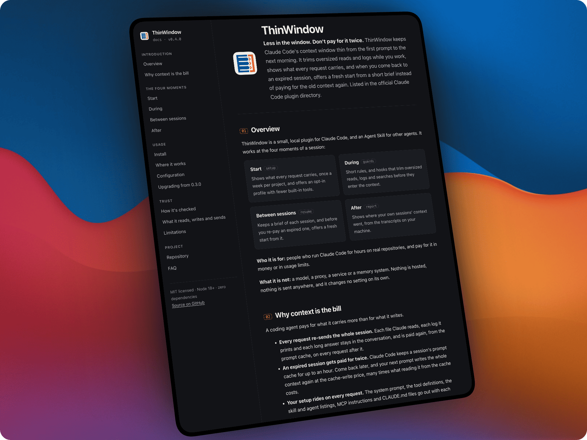

<div align="center">


</div>

<h1 align="center">ThinWindow</h1>

<p align="center">
  <strong>Menos na janela. Não pague duas vezes.</strong><br>
  O ThinWindow mantém fina a janela de contexto do Claude Code do primeiro prompt até a manhã seguinte. Ele corta leituras e logs desmedidos enquanto você trabalha, mostra o que cada requisição carrega e, quando você volta a uma sessão expirada, oferece recomeçar do zero a partir de um resumo curto em vez de pagar de novo pelo contexto antigo.<br>
  Listado no diretório oficial de plugins do Claude Code.
</p>

<p align="center">
  <a href="#instalação"><b>Instalação</b></a> · <a href="#o-que-o-thinwindow-faz">O que faz</a> · <a href="#onde-funciona">Onde funciona</a> · <a href="#o-que-ele-lê-escreve-e-envia">Privacidade</a> · <a href="https://thinwindow.github.io/thinwindow/">Site de documentação</a> (em inglês)
</p>

<p align="center">
  <a href="README.md">English</a> · <a href="README.es.md">Español</a> · <b>Português</b>
</p>

<p align="center">
  <a href="https://thinwindow.github.io/thinwindow/"></a>
</p>

## Por que o contexto é a conta

Um agente de código paga mais pelo que carrega do que pelo que escreve.

- **Cada requisição reenvia a sessão inteira.** Cada arquivo que o Claude lê,
  cada log que imprime e cada resposta longa fica na conversa e é pago de
  novo, a partir do cache de prompts, em cada requisição seguinte.
- **Uma sessão expirada é paga duas vezes.** O Claude Code mantém o cache de
  prompts de uma sessão por até uma hora. Se você voltar depois disso, o seu
  próximo prompt escreve todo o contexto de novo ao preço de escrita de cache,
  muitas vezes o que custa lê-lo do cache.
- **A sua configuração vai junto em cada requisição.** O prompt de sistema, as
  definições de ferramentas, as listas de skills e de agentes, as instruções de
  MCP e os arquivos CLAUDE.md saem com cada uma.

O ThinWindow atua nas três coisas, nos quatro momentos de uma sessão.

## O que o ThinWindow faz

### No começo: saber o que cada requisição carrega

**O aviso de custo de configuração.** Uma vez por semana e por projeto, quando
a primeira requisição de uma sessão tem 40k tokens ou mais, o ThinWindow mostra
uma linha para você: com quanto começa cada requisição daquela sessão e as suas
maiores partes. Exemplo:

```
ThinWindow: each request in this session starts at 54k tokens (skill listing 5.3k, deferred tools 2.5k, MCP instructions 1.6k). Run /context to see what you could turn off.
```

Ele é mostrado a você e nunca é enviado ao Claude. No app de desktop, aparece
como um "Claude Code notice" recolhido.

**`thinwindow-minimal`, um perfil opcional para sessões de código focadas.** Um
arquivo que você copia. Ele mantém o prompt de sistema do próprio Claude Code e
as suas ferramentas de MCP, e remove as ferramentas integradas que as sessões
do autor quase nunca usaram:

- subagentes e equipes de agentes;
- `/loop`, tarefas agendadas, gatilhos remotos e notificações push;
- as ferramentas de tarefas em segundo plano (comandos de Bash em segundo plano
  continuam funcionando);
- ler a lista de tarefas de volta (criar e atualizar tarefas continua
  funcionando);
- worktrees, notebooks e perguntas de múltipla escolha;
- o modo de plano ativado pelo Claude (Shift+Tab continua funcionando);
- a ferramenta Skill e, com ela, a lista de skills (as skills que você digita,
  como `/thinwindow:report`, continuam funcionando);
- no app de desktop: artifacts, a sincronização de design, os cartões de
  arquivo, o feedback e os achados de revisão.

```bash
curl -fsSL --create-dirs -o ~/.claude/agents/thinwindow-minimal.md https://raw.githubusercontent.com/thinwindow/thinwindow/main/profiles/thinwindow-minimal.md
claude --agent thinwindow-minimal
```

Ou, para todas as sessões de um projeto, `"agent": "thinwindow-minimal"` no
`.claude/settings.json` desse projeto. O ThinWindow nunca o ativa por você.

- **Não use quando** você quiser subagentes, `/loop`, tarefas agendadas ou
  skills que o Claude inicia por conta própria.
- **Enquanto o arquivo estiver em `~/.claude/agents/`,** as sessões que não o
  usam o listam entre os seus subagentes, numa linha que inclui a sua lista de
  ferramentas. Apague o arquivo para removê-lo.
- **A cópia não se atualiza sozinha** quando o Claude Code adiciona
  ferramentas. A lista exata está [no arquivo](profiles/thinwindow-minimal.md).

### Durante o trabalho: manter a janela fina

**As regras.** No início da sessão, o ThinWindow adiciona ao contexto do Claude
um conjunto curto de regras: localizar antes de ler e ler só o trecho
necessário; limitar a saída dos comandos; verificar se o código precisa existir
antes de escrevê-lo e fazer a menor mudança; não narrar entre chamadas de
ferramentas e terminar com no máximo três linhas. Elas ficam abaixo de 2.000
caracteres, e o CI verifica isso:
[`rules/thinwindow.md`](rules/thinwindow.md).

**Os controles.** Hooks que agem na própria chamada da ferramenta, antes que o
resultado entre no contexto, então aplicá-los não custa um turno.

- **Controle de Read:**
  - ler inteiro um arquivo de mais de 400 linhas devolve as suas primeiras 120
    linhas e um índice com números de linha, para que a próxima leitura mire
    um trecho;
  - reler um arquivo sem mudanças que já está no contexto é recusado.
- **Controle de Bash:**
  - instalações, builds, testes e linters passam pelo `thinwindow-run`;
  - buscas recursivas sem limite são limitadas, e um `git diff` sozinho roda
    como `git diff --stat`;
  - `cat` de um lockfile ou de um arquivo enorme, `git log` sem limite,
    `ls -R`, `tree` sem `-L` e um `find` sem limite são recusados, com um
    comando mais barato para rodar no lugar.
- **Limite do Grep:** uma busca de conteúdo sem limite recebe um de 100 linhas.

**`thinwindow-run`.** Ele roda um comando barulhento, guarda o log completo num
arquivo temporário e mostra ao Claude o código de saída, o final e as linhas de
erro. Uma saída curta volta como está.

**Falha aberto.**

- Se um controle falha, a chamada segue adiante.
- Repetir uma leitura ou um comando barulhento recusados também deixa passar,
  e os poucos comandos que são sempre recusados vêm com um que funciona. O
  Claude não fica travado.
- O ThinWindow nunca aprova uma chamada sobre a qual as suas configurações de
  permissão perguntariam.

### Entre sessões: retomar sem pagar duas vezes

**O resumo.** No fim de cada turno, o ThinWindow mantém atualizado um resumo
curto da sessão, sem chamar um modelo. Ele guarda:

- o objetivo;
- os seus últimos pedidos;
- os arquivos alterados;
- os últimos comandos, com os seus códigos de saída;
- a última resposta do Claude.

Uma sessão que nunca usa o resumo não ganha nenhum token por causa dele.

**O aviso de sessão expirada.** Você envia um prompt a uma sessão que está
parada há mais de uma hora e tem pelo menos 100k tokens de contexto. O
ThinWindow segura o prompt uma vez e mostra o que continuar reescreve, em
tokens e em US$ ao preço de tabela do modelo, ao lado de recomeçar do zero.
Exemplo:

```
ThinWindow held this message: this session has been idle 9 h, so its prompt cache has expired.
Continuing re-writes ~427k tokens (~US$3.42 at Opus 5.5 list price): send it again.
A fresh start from a short brief re-writes ~55k tokens (~US$0.44): /clear, then /thinwindow:resume <your request>.
```

- **Você decide toda vez:** envie o prompt de novo para continuar.
- **Nunca são segurados:** os comandos, nem os prompts em sessões `-p`, do SDK
  ou em segundo plano.
- **No app de desktop,** o aviso é um cartão "A hook blocked your prompt", com
  "Edit prompt" para enviá-lo de novo.

**`/thinwindow:resume`.** Depois de `/clear`, ele começa a sessão nova a partir
do resumo mais recente deste projeto, de até 48 horas. Você pode adicionar o
seu próximo pedido depois do comando. O resumo:

- tem no máximo 600 caracteres;
- vem marcado como referência, para o Claude conferir com `git status`;
- traz a sua idade, os commits feitos desde então e o caminho do resumo
  completo.

**`/thinwindow:brief`.** Antes de você sair, o Claude escreve uma passagem de
cinco linhas enquanto o cache ainda está quente: o que está feito, onde parou,
as decisões, o que não funcionou e o próximo passo. O ThinWindow a guarda no
resumo.

**O diálogo do próprio Claude Code, "Resume from summary",** aparece quando
você faz `--resume` de uma sessão grande depois de cerca de uma hora (planos
Pro e Max). O ThinWindow também cobre as sessões que você deixou abertas,
mostra o que custa continuar antes de você pagar e guarda um resumo para
qualquer `/clear` posterior.

### Depois: ver para onde foi o seu contexto

**`/thinwindow:report`.** Ele lê as transcrições das suas próprias sessões do
Claude Code nesta máquina e mostra, numa tela:

- quanto contexto cada requisição reenvia, em média e nas suas sessões mais
  longas;
- quantas vezes uma sessão foi reescrita depois que o cache expirou, com que
  tamanho e quanto essas reescritas custaram a preço de tabela;
- o que a primeira requisição de uma sessão carrega, e as suas maiores partes;
- a saída de qual ferramenta é mais reenviada (Bash, Read, ferramentas de
  MCP…), e em que tamanhos;
- o que o ThinWindow fez nos últimos 7 dias.

Os valores são o que está em jogo nas suas próprias sessões, não o que o
ThinWindow economizou. Numa assinatura, leia os US$ como um tamanho relativo.

## Instalação

**Pelo diretório de plugins:** no app de desktop do Claude, Customize → Plugins
→ Discover → ThinWindow; no Claude Code, `/plugin` → Discover → ThinWindow, ou:

```
claude plugin install thinwindow@anthropic-plugin-directory
```

**Por este repositório**, no Claude Code:

```
/plugin marketplace add thinwindow/thinwindow
/plugin install thinwindow@thinwindow
```

**Qualquer agente com Agent Skills** (Codex, Cursor, Copilot, Gemini CLI,
OpenCode…). Você recebe as regras, o `thinwindow-run` e o script do relatório:

```
npx skills add thinwindow/thinwindow
```

**Agentes que leem `AGENTS.md`:** cole [`adapters/AGENTS.md`](adapters/AGENTS.md)
no `AGENTS.md` do seu projeto.

Desligue o ThinWindow a qualquer momento com `THINWINDOW=off`, ou com
`"enabled": false` no `.thinwindow.json`. Ele precisa do Node.js 18 ou mais
recente, e de nada mais.

## Onde funciona

| Onde | O que o ThinWindow faz ali |
| --- | --- |
| Claude Code (terminal, IDE, a aba Code do app de desktop) | Tudo: as regras, os controles, o resumo, o aviso de sessão expirada, o aviso de custo de configuração e os comandos `/thinwindow:`. O perfil `thinwindow-minimal` funciona pelo terminal. |
| Cowork | Funcionam as regras, o controle de Read e o `/thinwindow:brief`. O `/thinwindow:report` cobre só a tarefa atual, os resumos não passam de uma tarefa para outra e nenhum dos dois avisos aparece. |
| Chat (claude.ai, os apps de desktop e móveis) | Só a Agent Skill: o Claude carrega as regras quando decide que uma tarefa precisa delas, e o `/thinwindow:brief` funciona. Os outros comandos precisam de um shell, que o chat não roda. |

A validação do ThinWindow rodou no Claude Code. No Cowork e no chat, foi
verificado o que funciona, sem medir.

## Veja as suas próprias sessões

Instale o ThinWindow, trabalhe normalmente por alguns dias e digite
`/thinwindow:report`. Ele mostra para onde foi o contexto das suas sessões,
medido no seu próprio trabalho em vez de num benchmark.

- **`/thinwindow:report --json`** imprime um resumo curto sem valores em US$.
  Você pode colá-lo na
  [#43](https://github.com/thinwindow/thinwindow/issues/43), o que ajuda a
  decidir o que o ThinWindow vai construir depois.
- **Nada é coletado automaticamente.**

## Como é verificado

Antes, o ThinWindow publicava uma porcentagem de benchmark por modelo. Desde a
0.4.0, ele é verificado com outro método
([#28](https://github.com/thinwindow/thinwindow/issues/28)):

- **Cada mecanismo tem testes unitários,** que rodam no CI em macOS, Linux e
  Windows.
- **As ideias são testadas primeiro repetindo sessões gravadas,** sem custo de
  modelo, para ver o que está em jogo.
- **Algumas execuções de agente direcionadas** respondem o que só um modelo
  pode responder, com os critérios de aprovação escritos antes da primeira
  execução.
- **A 0.4.0 foi validada antes do lançamento** contra o Claude Code sem o
  plugin, em repositórios reais de código aberto. O método e as regras de
  aprovação foram publicados antes da primeira execução
  ([#38](https://github.com/thinwindow/thinwindow/issues/38)).
  - Todas as tarefas do benchmark e todas as cadeias de retomada foram
    concluídas com o ThinWindow, assim como sem ele.
  - Quando a segunda tarefa de uma cadeia recomeçou do zero depois que o cache
    de prompts expirou, ela custou menos por cadeia concluída do que continuar.

O método, as linhas brutas e as transcrições limpas dos agentes são públicos:
[`bench/README.md`](bench/README.md) (em inglês).

## Configuração

O ThinWindow funciona sem configuração. Para mudá-la, crie `.thinwindow.json`
num projeto, ou `~/.thinwindow.json` na sua pasta pessoal. Os valores do
projeto têm prioridade sobre os da pasta pessoal.

| Chave | Padrão | O que faz |
| --- | --- | --- |
| `enabled` | `true` | `false` desliga todos os hooks |
| `maxReadLines` | `400` | Linhas a partir das quais a leitura de um arquivo inteiro é encurtada |
| `rewrite` | `true` | Corrige no lugar as chamadas que desperdiçam; `false` as recusa |
| `briefs` | `true` | `false` para de guardar os resumos de sessão |
| `coldResumeNotice` | `true` | `false` desliga o aviso de sessão expirada |
| `coldResumeMinTokens` | `100000` | Contexto mínimo para o qual o aviso segura um prompt |
| `setupNotice` | `true` | `false` desliga o aviso de custo de configuração |
| `setupNoticeMinTokens` | `40000` | Primeira requisição mínima para a qual o aviso aparece |
| `noisyCommands` | lista integrada | Padrões extras de comandos barulhentos |
| `allowlist.paths`, `allowlist.commands` | `[]` | Arquivos e comandos que o ThinWindow nunca toca |

Todas as opções, e o que cada hook faz:
[docs/configuration.md](docs/configuration.md) (em inglês).

## Atualizar a partir da 0.3.0

Nada que funcionava deixa de funcionar, e cada parte nova tem o seu próprio
interruptor.

- **Hooks novos:** no fim de cada turno (o resumo e o aviso de custo de
  configuração) e antes de cada prompt (o aviso de sessão expirada).
- **Comandos novos:** `/thinwindow:resume`, `/thinwindow:brief` e
  `/thinwindow:report`. Você os digita; eles não acrescentam nada à lista de
  skills que o Claude vê.
- **Interruptores novos:** `briefs`, `coldResumeNotice`, `coldResumeMinTokens`,
  `setupNotice` e `setupNoticeMinTokens`.
- **Novo e opcional:** o perfil `thinwindow-minimal`, um arquivo que você copia.
- **Mudaram:** as regras, que dizem o mesmo em menos palavras.

## O que ele lê, escreve e envia

- **Lê:**
  - a chamada que o Claude Code passa aos hooks (um caminho de arquivo, um
    comando ou um padrão de busca), e a contagem de linhas e o índice dos
    arquivos que o Claude vai ler ou imprimir;
  - as suas configurações em `.thinwindow.json`;
  - as variáveis de ambiente `THINWINDOW`, `THINWINDOW_DEBUG`,
    `CLAUDE_PROJECT_DIR`, `CLAUDE_PLUGIN_DATA` e
    `CLAUDE_CODE_SESSION_ATTENDED`;
  - antes de cada prompt, os últimos 256 KB da transcrição da sessão, e os
    primeiros 256 KB quando cabe um aviso de sessão expirada;
  - no fim de cada turno, a parte da transcrição escrita desde o turno
    anterior, e os seus primeiros 256 KB enquanto puder caber um aviso de custo
    de configuração;
  - `git status` na pasta da sessão, depois de um turno que pode ter mudado
    arquivos. O `/thinwindow:resume` também roda `git log` ali, para os commits
    feitos desde o resumo.

  Ele não lê credenciais.
- **Escreve, na pasta temporária do seu sistema operacional:**
  - um arquivo pequeno por sessão: quais arquivos e trechos foram lidos, as
    recusas recentes, quando um aviso de sessão expirada foi mostrado pela
    última vez e contagens do que os hooks fizeram;
  - um arquivo mínimo por projeto: quando o aviso de custo de configuração foi
    mostrado pela última vez;
  - o log completo de cada comando que passa pelo `thinwindow-run`.
- **Escreve, na pasta de dados do plugin** (`~/.claude/plugins/data/`): um
  resumo pequeno por sessão, numa pasta por projeto. Um resumo guarda
  **trechos dos seus prompts e das respostas do Claude**:
  - o primeiro prompt, até 200 caracteres;
  - os últimos três pedidos, até 80 cada;
  - a última resposta, até 1.200;
  - os arquivos alterados;
  - os últimos quatro comandos, até 70 caracteres cada, com os seus códigos de
    saída.

  `"briefs": false` para de escrevê-los.
- **Apaga:** o ThinWindow remove os seus arquivos quando completam 7 dias, na
  próxima vez que roda.
  - O Claude Code apaga a pasta de dados do plugin quando você desinstala o
    plugin.
  - Se você remover o ThinWindow da sua conta no app de desktop do Claude, os
    resumos podem ficar. Apague a pasta `thinwindow-*` em
    `~/.claude/plugins/data/` para removê-los.
- **Envia:** nada. Não há código de rede. Um resumo entra numa conversa só
  quando você digita `/thinwindow:resume`.

**O `/thinwindow:report`** lê as suas transcrições do Claude Code, só quando
você o roda.

- **Lê:** `~/.claude/projects/**/*.jsonl` (`$CLAUDE_CONFIG_DIR/projects` se
  você o definiu), uma linha por vez, e as contagens do próprio ThinWindow na
  pasta temporária. Ele não escreve nada.
- **Imprime:** números agregados, com rótulos próprios.
- **Nunca imprime:** prompts, conteúdo de arquivos, comandos, caminhos, nomes
  de projetos, ids de sessão, nem os nomes das suas ferramentas, modelos ou
  servidores de MCP. Um teste verifica isso.
- **Envia:** nada. Pelo comando de barra, os números impressos passam a fazer
  parte da sua conversa, como a saída de qualquer comando. Para deixá-los de
  fora, rode você mesmo o script:
  `! node <pasta do plugin>/skills/thinwindow/scripts/thinwindow-report.mjs`.

Se o Claude Code mudar o formato das transcrições, o relatório diz "format not
recognized" em vez de imprimir números errados.

## Limites

- **O ThinWindow foi pensado para sessões longas,** e para voltar a sessões
  grandes. Uma tarefa curta carrega pouco contexto para começar.
- **Os hooks precisam do Claude Code.** Os outros agentes recebem as regras, e
  o Cowork e o chat recebem as partes de [Onde funciona](#onde-funciona).
- **Os valores em US$ são estimativas a preço de tabela da API.** Não são uma
  conta.
- **Sem garantia.** O ThinWindow é fornecido "como está", sob a
  [licença MIT](LICENSE). Os hooks foram feitos para falhar abertos, e os
  testes cobrem isso, mas revise o código antes de confiar trabalho real a ele.

## Perguntas frequentes

**Ele deixa o Claude pior na tarefa?**

- Na validação da 0.4.0, todas as tarefas do benchmark e todas as cadeias de
  retomada foram concluídas com o ThinWindow tantas vezes quanto sem ele.
- Uma revisão às cegas das respostas finais as considerou corretas e completas
  nas duas condições.
- Todos os controles falham abertos.

**Qual a diferença para o "Resume from summary" do Claude Code?**

- Esse diálogo aparece quando você faz `--resume` de uma sessão grande depois
  de cerca de uma hora, nos planos Pro e Max.
- O ThinWindow também cobre as sessões que você deixou abertas, mostra o que
  custa continuar em tokens e US$ antes de você pagar, e guarda um resumo para
  qualquer `/clear` posterior.

**O aviso de sessão expirada vai me interromper?**

- No máximo uma vez por pausa: só depois de uma hora parada, e só com mais de
  100k tokens de contexto.
- Envie o prompt de novo para continuar, ou desligue o aviso com
  `"coldResumeNotice": false`.

**Ele envia o meu código para algum lugar?** Não.

- Não há código de rede: nem analytics, nem relatórios de falhas, nem
  verificação de atualizações.
- Os hooks são scripts Node locais.

**Funciona fora do Claude Code?**

- As regras sim, por Agent Skills ou `AGENTS.md`.
- Os hooks precisam do Claude Code.
- O Cowork e o chat recebem as partes de [Onde funciona](#onde-funciona).

## Contribuir

As contribuições mais úteis, em ordem:

1. **Uma tarefa do seu próprio stack:** outra linguagem, um monorepo, um
   framework com muito código gerado.
2. **Uma regressão reproduzível,** com as linhas que a mostram.
3. **Uma proposta de regra ou de hook,** com a tabela de conformidade
   (`node bench/compliance.mjs`). Quando a decisão depende de como o modelo
   reage, acrescente algumas execuções direcionadas, com os critérios de
   aprovação escritos antes de rodá-las.

O fluxo de trabalho está em [CONTRIBUTING.md](CONTRIBUTING.md) (em inglês).

## Licença

MIT
